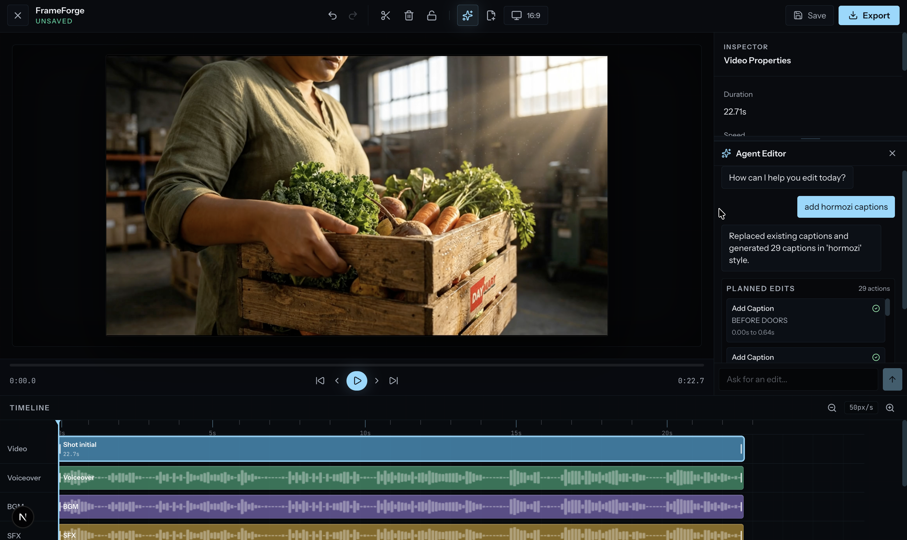
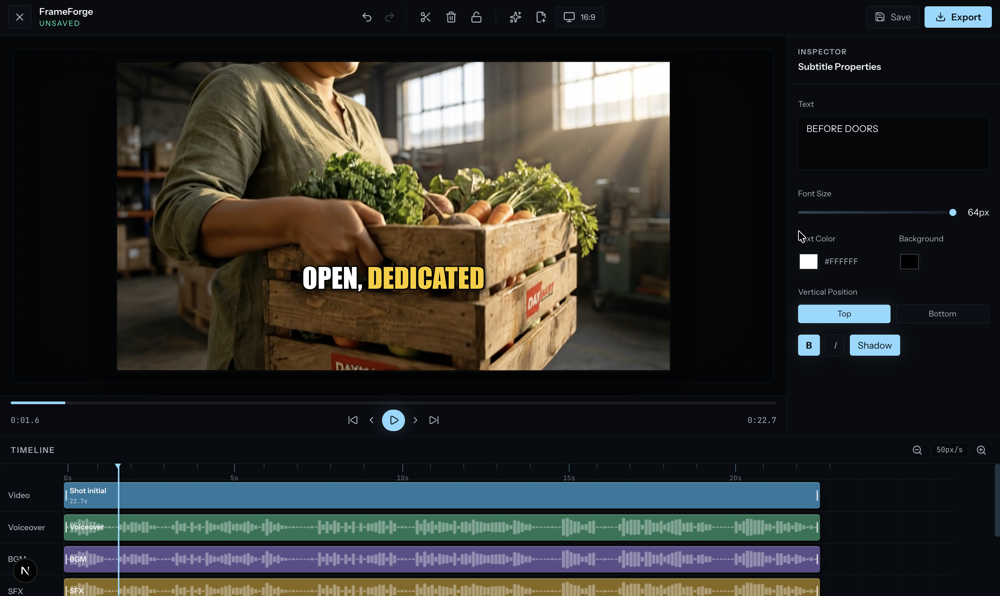
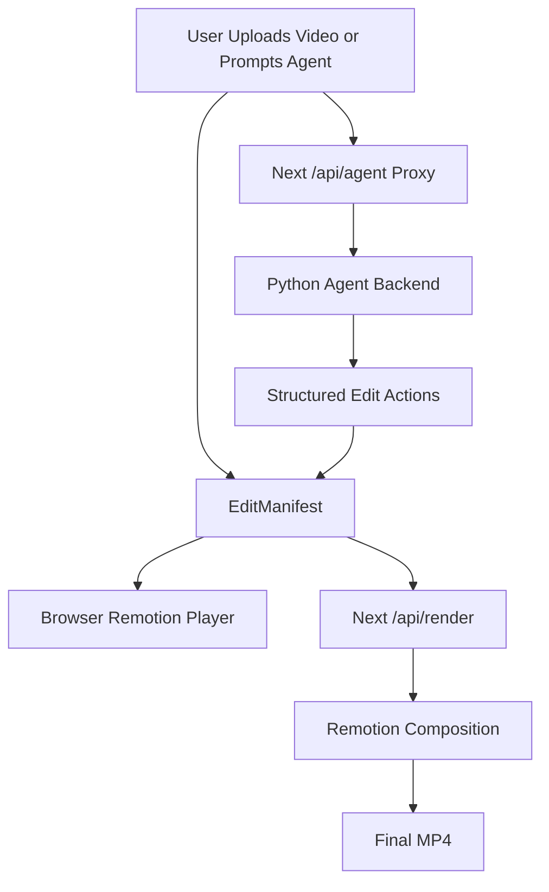

# FrameForge

FrameForge is an open-source, browser-native agentic video editor. Upload a video, edit on a multi-track timeline, ask the agent for changes, preview instantly in the browser, and render the final MP4 with Remotion.

## See It In Action

| Ask the agent for an edit | Review and apply it on the timeline |
| --- | --- |
|  |  |

## What FrameForge Does

- **Runs in the browser**: Next.js editor UI with a Remotion-powered preview.
- **Edits through chat**: Ask for captions, text overlays, trim/split/delete actions, silence removal, transitions, and timeline changes.
- **Keeps keys server-side**: A local Python Flask backend handles OpenAI calls and returns structured edit actions.
- **Uses a real timeline**: Dedicated lanes for video, voiceover, BGM, SFX, captions, and overlays.
- **Renders from the same source of truth**: Every edit becomes an `EditManifest` that drives both preview and MP4 export.

## Quick Start

### Requirements

- Node.js 20+
- Python 3.11 or 3.12 recommended
- FFmpeg
- OpenAI API key

Install FFmpeg on macOS:

```bash
brew install ffmpeg
```

### 1. Install The Editor

```bash
npm install
```

### 2. Install The Agent Backend

```bash
cd backend
python3 -m venv .venv
source .venv/bin/activate
pip install -r requirements.txt
cd ..
```

### 3. Configure OpenAI

```bash
cp .env.example .env.local
```

Edit `.env.local`:

```bash
OPENAI_API_KEY=your_openai_key
OPENAI_MODEL=gpt-5.2
AGENT_BACKEND_URL=http://127.0.0.1:5001
FRAMEFORGE_ROOT=
```

`FRAMEFORGE_ROOT` can stay empty when commands are run from the repo root.

Optional auth between Next.js and the Python backend:

```bash
AGENT_API_KEY=shared_secret
API_KEY=shared_secret
```

### 4. Start The App

Use two terminals.

Terminal 1, agent backend:

```bash
source backend/.venv/bin/activate
npm run agent:dev
```

Terminal 2, browser editor:

```bash
npm run dev
```

Open:

```text
http://localhost:3001
```

### 5. Verify Agent Connection

```bash
curl http://127.0.0.1:5001/health
```

Expected response shape:

```json
{
  "ok": true,
  "service": "frameforge-agent",
  "openaiConfigured": true
}
```

If `openaiConfigured` is `false`, check `.env.local`, make sure `OPENAI_API_KEY` is set, and restart `npm run agent:dev`.

## Try Your First Agent Edit

1. Open `http://localhost:3001`.
2. Upload a local video or paste a video URL.
3. Open the agent chat panel.
4. Ask for an edit:

```text
add hormozi captions
```

5. Review the proposed actions.
6. Apply one action or apply all.
7. Preview the result and render/export when it looks right.

Caption highlights are stored as style metadata, so generated captions should not show raw `*asterisks*`.

## Common Commands

```bash
# Frontend only
npm run dev

# Agent backend only, after activating backend/.venv
npm run agent:dev

# Run both services from one shell
npm run dev:all

# Type-check
npm run type-check

# Tests
npm test -- --run

# Production build
npm run build
```

## How It Works

FrameForge follows a **Write Once, Render Anywhere** model.

### Edit Manifest

The `EditManifest` is the source of truth. It stores source media references, clip timing, track layout, captions, overlays, styles, and audio settings. It does not store raw video bytes.

### Browser Preview

The editor passes the manifest into Remotion React components. The browser renders video/audio plus HTML/CSS overlays immediately, so timeline changes are visible without encoding.

### Agent Backend

The browser sends prompts and the current manifest to Next.js routes under `/api/agent/*`. Next proxies the request to the local Python backend, where the agent routes the task and returns safe, structured edit actions.

### MP4 Render

The render API loads the same Remotion composition in a headless browser and renders frames through FFmpeg into a real MP4.



## Features

- Multi-track timeline for video, voiceover, BGM, SFX, captions, and overlays
- Video, audio, and image imports
- Clip trimming, splitting, deleting, and range removal
- Agent-planned captions, overlays, trims, transitions, and timeline edits
- Proposed timeline changes before applying agent actions
- Batch undo for multi-action agent edits
- Keyboard playback and editing shortcuts
- MP4 rendering through Remotion

## Keyboard Shortcuts

| Key | Action |
|-----|--------|
| `Space` | Play/Pause |
| `← / →` | Previous/Next frame |
| `Shift + ← / →` | Back/Forward 1 second |
| `S` | Split clip at playhead |
| `Delete` | Delete selected clip |
| `Cmd + Z` | Undo |
| `Cmd + Shift + Z` | Redo |

## Use As A Component

```tsx
import { VideoEditor } from 'frameforge-editor'

function EditorPage({ video, shots }) {
  return (
    <VideoEditor
      video={video}
      shots={shots}
      onSave={(manifest) => {
        // Persist or render the manifest.
      }}
      onClose={() => router.back()}
    />
  )
}
```

## Troubleshooting

### Backend Says OpenAI Is Not Configured

Run:

```bash
curl http://127.0.0.1:5001/health
```

If `openaiConfigured` is `false`, add `OPENAI_API_KEY` to `.env.local`, restart `npm run agent:dev`, and run the health check again.

### Agent Chat Works But Edits Do Not Apply

Make sure the backend and frontend are both running, the uploaded media still exists under `public/uploads`, and the browser is pointed at `http://localhost:3001`.

### Captions Are Empty Or Weak

Install FFmpeg, restart the backend inside the virtual environment, and try a clip with clear speech. For low-speech product or fashion videos, the caption agent can fall back to visual frame analysis.

## Documentation

- [System Design](./docs/system_design.md) - backend integration and data flow
- [Deployment Plan](./docs/deployment_plan.md) - GCS and Cloud Run deployment notes
- [Upcoming Features](./docs/upcoming_plan.md) - roadmap and product ideas

## Tech Stack

- React 18
- Next.js
- Remotion
- Zustand with Immer
- Tailwind CSS
- Flask
- OpenAI
- faster-whisper
- FFmpeg
- Vitest
