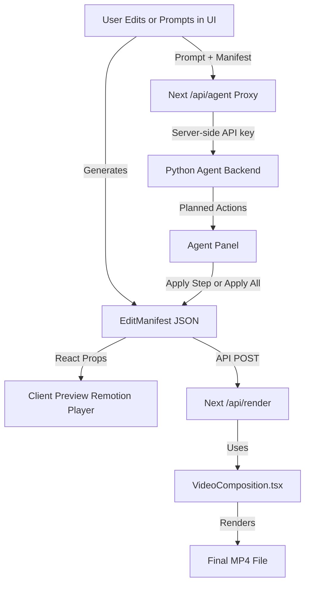

# Owly Video Editor

A modular timeline-based video editor for post-processing AI-generated videos from [Owly Studio](https://owly.studio).

## Overview

Owly Editor is a standalone React/Next.js video editor with timeline editing, Remotion preview/rendering, and an optional local Python agent backend. It can run independently as a browser-native agentic video editor while still exporting the same lightweight edit manifest used by Owly Studio.

## Architecture & Data Flow

Owly Editor uses a **"Write Once, Render Anywhere"** philosophy powered by Remotion.

### 1. The Edit Manifest (Single Source of Truth)
Everything transforms into a lightweight JSON object called the `EditManifest`. This JSON contains:
- Cut points (start/end times)
- Subtitle text and timing
- Audio levels and styling
- *No video data, only references to URLs*

### 2. Client-Side: The Preview (Instant)
**Where**: Browser (`/dashboard/editor/[id]`)
**What**: `@remotion/player`
**How**: 
- The React components (`VideoComposition`) read the JSON Manifest.
- They render HTML/CSS on top of a `<video>` tag.
- **Hybrid Audio**: Uses standard `<Audio>` for files and `<OffthreadVideo>` for complex video-based audio to ensure compatibility.
- **Result**: Instant playback. No "rendering" or encoding happens here. It's just a web page updating in real-time.

### 3. Server-Side: The Render (High Quality)
**Where**: Backend / Cloud (AWS Lambda or Render Service)
**What**: `@remotion/cli` or `@remotion/lambda`
**How**:
- The **exact same** React components (`VideoComposition`) are loaded in a headless browser.
- Remotion steps through frame-by-frame, takes a screenshot of the DOM, and feeds it to FFmpeg.
- **Result**: A real MP4 file (`final_output.mp4`) where all your React components (subtitles, overlays) are burned into the pixels.

### 4. Agentic Editing (Optional)
**Where**: Browser editor panel + local Python service (`backend/app.py`)
**What**: Chat-based edit planning and safe timeline action application.
**How**:
- The browser sends prompts and the current `EditManifest` to same-origin Next routes under `/api/agent/*`.
- Next proxies the request to the Python agent backend, keeping agent API keys server-side.
- The backend routes intent to editing agents for trim/split/delete, silence removal, captions, transitions, visual analysis, and general timeline planning.
- The editor previews proposed changes as phantom timeline clips before applying them.



## Features

### Core Editing
- **Multi-Track Timeline**: 6 dedicated lanes for professional compositing:
  1. **Video** (Visuals)
  2. **Voiceover** (AI Narration)
  3. **BGM** (Background Music)
  4. **SFX** (Sound Effects)
  5. **Captions** (Subtitles)
  6. **Overlays** (Images/Logos)
- **Universal Import**: Import Video (`.mp4`, `.mov`), Audio (`.mp3`, `.wav`), and Images (`.png`, `.jpg`, `.svg`) with automatic track routing.
- **Clip Trimming**: Drag edges to trim clips with frame-accurate precision.
- **Split & Delete**: Split clips at playhead (S key), delete unwanted sections
- **Reordering**: Drag & drop to reorder clips (logic implemented, UI pending)
- **Agent Actions**: Chat with the editor to plan and apply trim, split, delete, remove-range, captions, text overlays, and transitions.
- **Planned Edit Preview**: Agent actions appear as proposed timeline clips before you apply them.
- **Batch Undo**: Applying multiple agent actions records one undo checkpoint.

### Video Preview
- **Real-time Preview**: Powered by Remotion Player
- **Playback Controls**: Play/pause, step frames, seek to position
- **Keyboard Shortcuts**: Space to play, arrow keys to navigate

### State Management
- **Undo/Redo**: Full history support for all editing actions
- **Edit Manifest**: Generates a JSON manifest describing all edits for backend rendering

## Installation

```bash
# From the owly_editor directory
npm install
```

### Agent Backend Setup

The agent backend is optional for normal manual editing, but required for chat-based editing.

```bash
cd backend
python3 -m venv .venv
source .venv/bin/activate
pip install -r requirements.txt
```

Install FFmpeg for silence detection and local media analysis:

```bash
brew install ffmpeg
```

Create a local environment file or export these values before running the services:

```bash
GEMINI_API_KEY=your_gemini_key
AGENT_BACKEND_URL=http://127.0.0.1:5001
AGENT_API_KEY=optional_shared_secret
```

If `AGENT_API_KEY` is set for Next, set the same value as `API_KEY` or `AGENT_API_KEY` for the Python backend.

## Development

```bash
# Start development server (Demo page)
npm run dev
# Open http://localhost:3001
```

```bash
# Start the Python agent backend
npm run agent:dev
```

```bash
# Start both services from the repo root
npm run dev:all
```

## Testing

This module uses Vitest for unit testing core logic.

```bash
# Run tests
npm test -- --run

# Type-check
npm run type-check

# Production build
npm run build
```

## Usage

```tsx
import { VideoEditor } from '@owly/editor'

function EditorPage({ video, shots }) {
  const handleSave = async (manifest) => {
    // Send manifest to backend
  }

  return (
    <VideoEditor
      video={video}
      shots={shots}
      onSave={handleSave}
      onClose={() => router.back()}
    />
  )
}
```

## Keyboard Shortcuts

| Key | Action |
|-----|--------|
| `Space` | Play/Pause |
| `← / →` | Previous/Next frame |
| `Shift + ← / →` | Back/Forward 1 second |
| `S` | Split clip at playhead |
| `Delete` | Delete selected clip |
| `Cmd + Z` | Undo |
| `Cmd + Shift + Z` | Redo |

## Documentation

For more detailed information on setup and planning, see the following:
- [**System Design**](./docs/system_design.md) - How the backend integration works.
- [**Deployment Plan**](./docs/deployment_plan.md) - Step-by-step GCS and Cloud Run setup.
- [**Upcoming Features**](./docs/upcoming_plan.md) - Future roadmap and business value.

## Tech Stack

- **React 18**
- **Remotion**
- **Zustand** (with Immer)
- **Vitest**
- **Tailwind CSS**
- **Next.js API Routes**
- **Flask + LangGraph-compatible Python agents**
- **Gemini / faster-whisper / FFmpeg** for agent planning, captions, and media analysis
