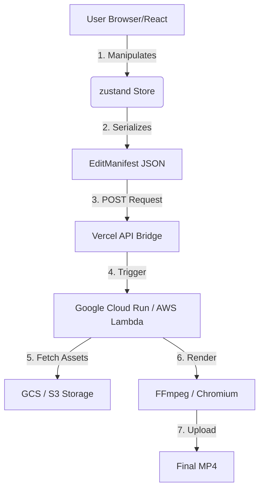

# FrameForge: System Design Plan

This document explains the high-level architecture and data flow of FrameForge, focusing on how the React frontend interacts with the serverless backend.

## 1. High-Level Architecture

The system is split into three main layers: the **Creative Layer** (UI), the **State Layer** (JSON), and the **Rendering Layer** (Engine).

## 2. The EditManifest (The Source of Truth)

The core "brain" of the integration is the **EditManifest**. Instead of sending heavy video files back and forth, the editor only sends a tiny JSON file that describes exactly what changed.

**What's inside the Manifest:**
- **Source Offsets**: Start and end timestamps of the original video.
- **Transformations**: Brightness, contrast, and scaling (16:9/9:16).
- **Overlays**: Subtitle text, fonts, and coordinate positions.
- **Audio**: Volume levels and master mute state.

## 3. Backend Rendering Flow

When the user clicks "Export," the following sequence occurs:

1. **State Snapshot**: The React app calls `generateManifest()`.
2. **Bridge Handover**: The manifest is sent to a Next.js/Vercel API route.
3. **Container spin-up**: Google Cloud Run (Option B) detects the request and starts a "hot" container.
4. **Virtual Headless Browser**: Remotion starts a headless Chromium instance within the container.
5. **Dynamic Reconstruction**: The container "replays" the EditManifest in React on the server.
6. **Frame Capture**: Chromium takes a snapshot of every frame at 30fps.
7. **Encoding**: FFmpeg takes those snapshots and encodes them into a high-quality H.264 MP4.

## 4. Security & Optimization

- **Pre-signed URLs**: All video assets are fetched using temporary pre-signed URLs to keep your GCS buckets private.
- **Concurrency**: Cloud Run handles multiple users by spawning separate containers, ensuring no single render blocks the entire system.
- **Lookahead**: The `premountFor` and `prefetch` optimizations we implemented ensure the frontend preview is as close to the final render as possible.

---

## 5. Future AI Integration Bridge

To support **AI Shot Regeneration**, the backend will be extended to:
1. Identify a `shotId` in the manifest.
2. Call the Fal.ai / Kling API.
3. Update the GCS source URL with the new generated clip.
4. Re-render the final video seamlessly.
